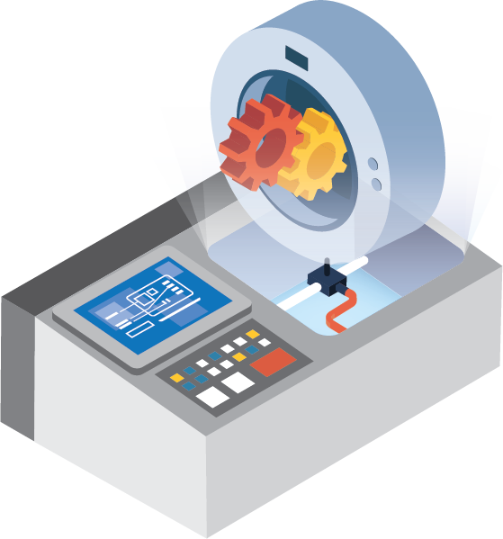

## It's Complicated: A guide to closed-loop, naturalistic, and complex fMRI experiments

\<Insert Avril Lavigne reference here>

Real-world experiences are a continuous perception-decision-action loop, and an often unspoken assumption in neuroscience is that we want to understand how the brain behaves in the real world. Yet, most of our laboratory experiments use open-loop experiments that don't allow for naturalistic interaction. Because the the brain is nonlinear, it's unclear whether such open-loop experiments can really tell us how the brain behaves in the real world.

The experimental challenge to closed-loop naturalistic experiments that better reflect real-world situations is that things suddenly get very complicated thanks to emergent complexity and chaos. Traditional experimental software platforms aren't appropriate or capable for these experiments. We use a game engine to overcomes the software limitations, and in this repo we provide a guide for how to make experiments in game engines.

This repo is composed of two parts:
- A conceptual overview on the paradigm differences between closed-loop experiments in game engine versus open-loop experiments in more tradition experimental software. This is mainly found in the documentation, and is on [the page hosted on our lab website](https://gallantlab.org/Its-Complicated).
- A set of practical tools. Primarily, the experiment infrastructure has been distilled into a Unreal plugin, which can be dropped into new Unreal projects. The code is hosted in this repo, and a guide and API reference are also in the docs/hosted page.

##### What this is
This is a collection of tools that reflect an approach to running things in the MRI. These tools each simplify or make possible some aspect of complex closed-loop experiments.

##### What this isn't
This is not a ready-to-go experiment builder. That's not feasible given how unique each situation is. These tools rather give you the paradigm and infrastructure to build experiments from scratch.

### Unreal Plugins
These plugins help you build an experiment from the ground-up in Unreal Engine. Obviously, you can lift the logic and apply it to other engines like Unity.
#### MRIExperiment
This is lifted out of the driving simulator. These things take care of the experiment logic framework in Unreal that makes all the things possible.

#### Eyelink
This is a plugin that will talk to an Eyelink system and display calibration stuff.

### Standalone Programs
These things are helpers for when you run your experiment.
#### [GameMonitor](https://github.com/gallantlab/gamemonitor)
A thing that will talk to Eyelink, log the state of a controller, and also start/stop OBS screen recordings

#### [SharpEyes](https://github.com/candytaco/SharpEyes)
Because eyetracking is messy, this lets you manually correct eyetracking stuff, and also has a model-free gaze mapping, if you have the raw videos and know where the calibration dots are.

### Python libraries
#### [Demofiles](https://github.com/gallantlab/demofiles)
A Python library to read demofiles put out by Source Engine-based games.